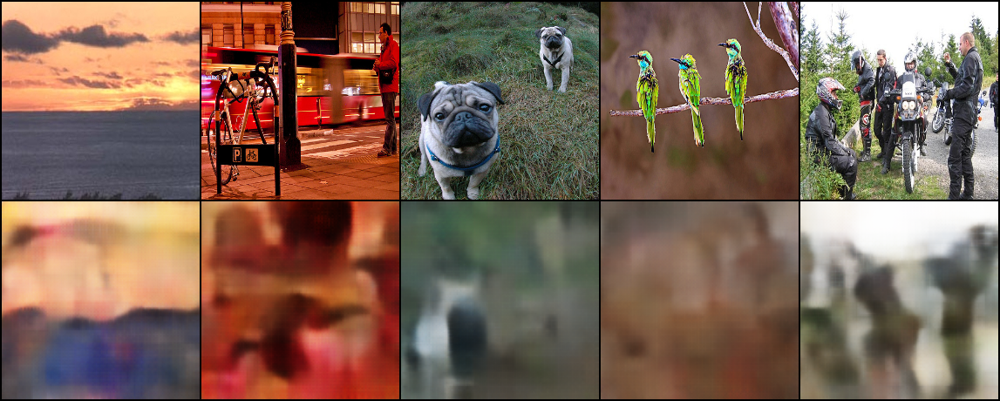
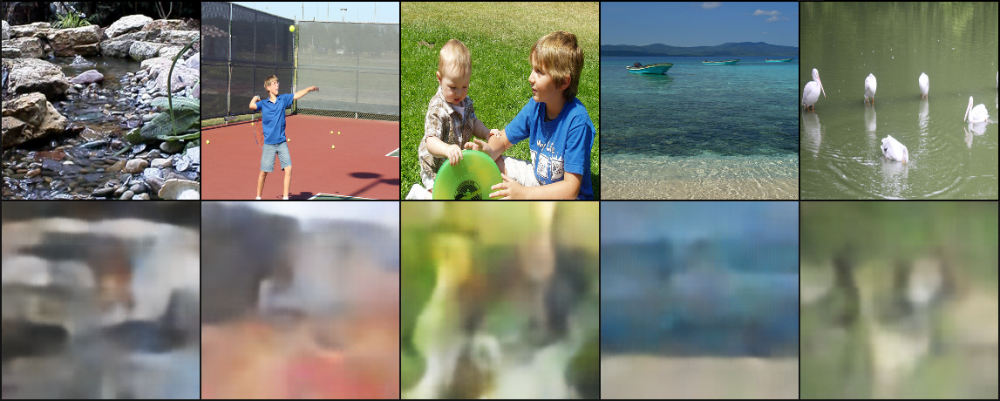
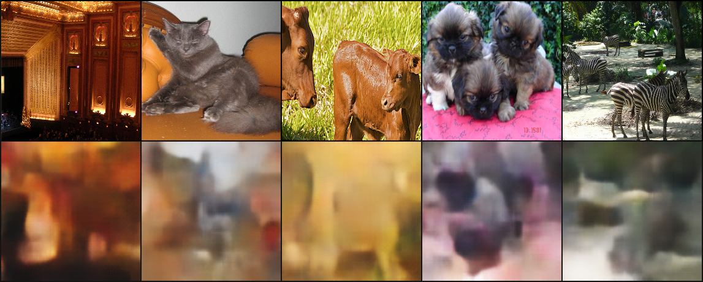

# Comparisons 
Comparisons of ordered input data with respective labels, 0, 1, 2 3, 4+ with their decoded versions

## Figures

Network parameters include batch size of 64, z dimensionality of 64 and fully connected size of 1024. A VAE with convolutional encoders and decoders was used to generate these. 

