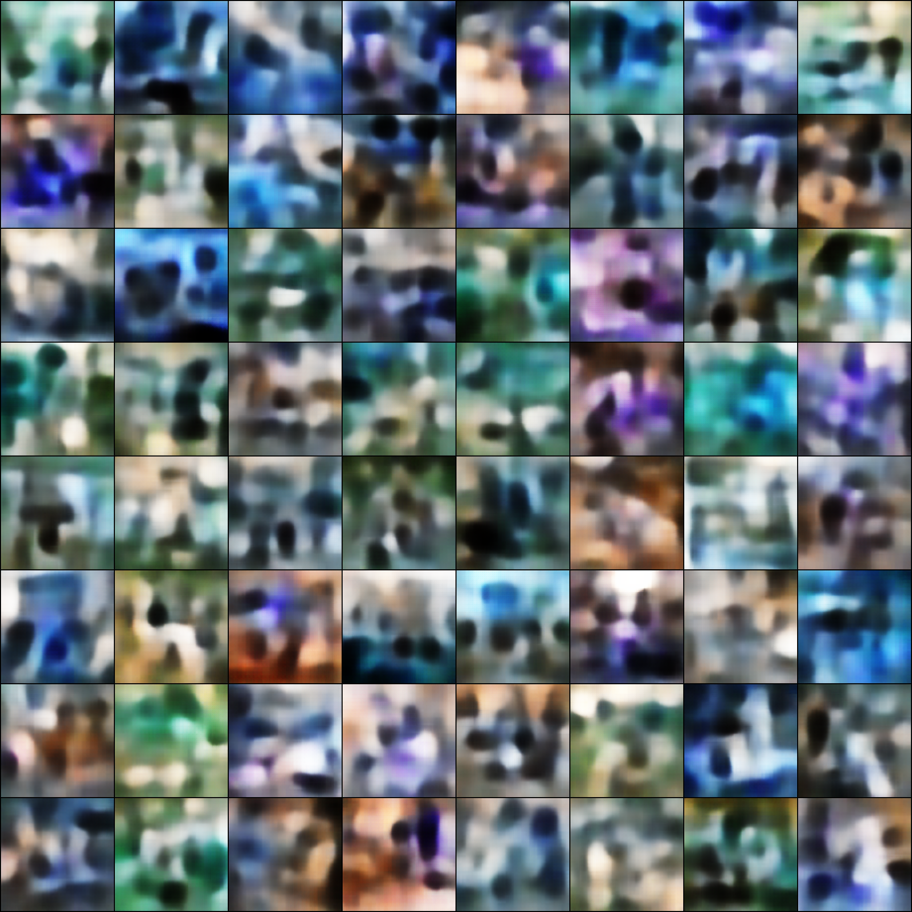
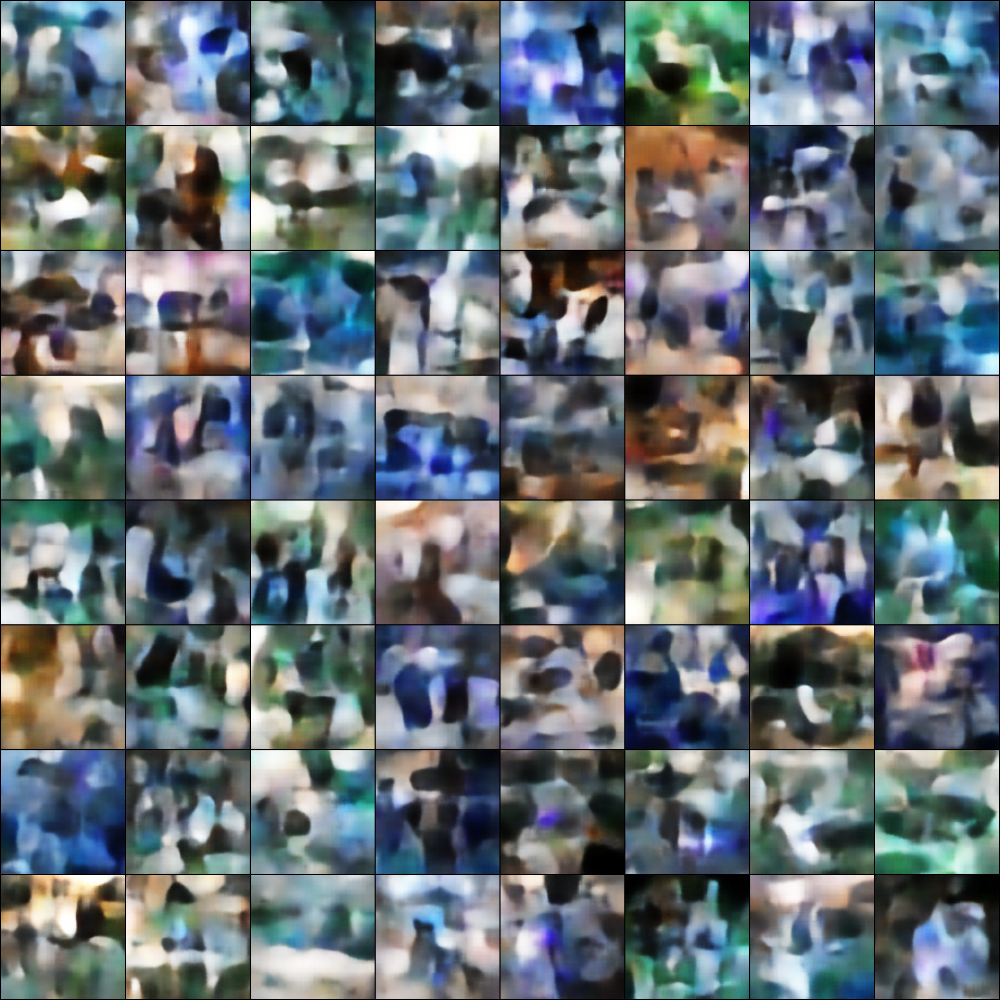

#  Visualisation of Latent Vector Samples
Visualisation of randomly sampled latent vector samples z.
Samples were generated with a convolutional VAE. Network parameters include batch size of 64, z dimensionality of 64 and fully connected size of 1024. The loss at epoch 54 was lower than epoch 349, but the images produced by the network seemed to be much sharper and "detailed" at epoch 349.

## Epoch 54

## Epoch 349

